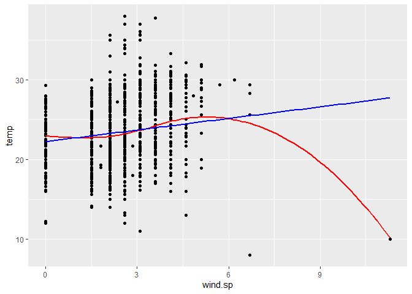
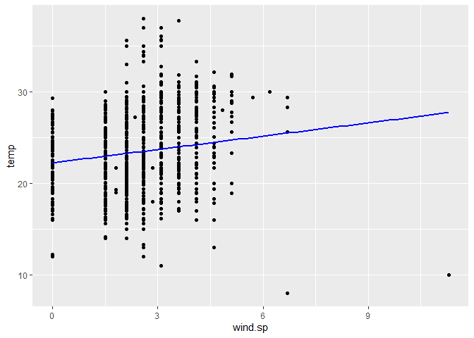
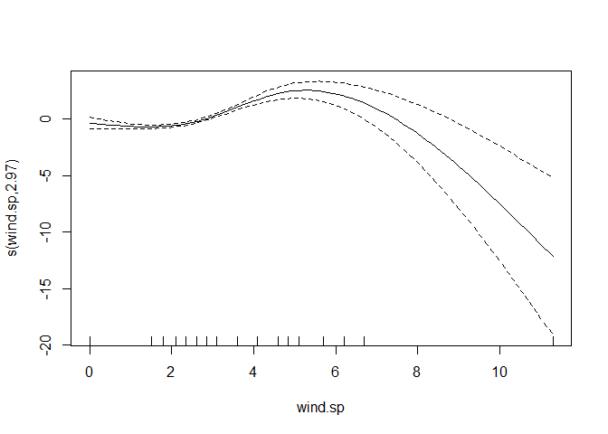

Lab 05 - Data Wrangling
================

# Learning goals

- Use the `merge()` function to join two datasets.
- Deal with missings and impute data.
- Identify relevant observations using `quantile()`.
- Practice your GitHub skills.

# Lab description

For this lab we will be dealing with the meteorological dataset `met`.
In this case, we will use `data.table` to answer some questions
regarding the `met` dataset, while at the same time practice your
Git+GitHub skills for this project.

This markdown document should be rendered using `github_document`
document.

# Part 1: Setup a Git project and the GitHub repository

1.  Go to wherever you are planning to store the data on your computer,
    and create a folder for this project

2.  In that folder, save [this
    template](https://github.com/JSC370/jsc370-2023/blob/main/labs/lab05/lab05-wrangling-gam.Rmd)
    as “README.Rmd”. This will be the markdown file where all the magic
    will happen.

3.  Go to your GitHub account and create a new repository of the same
    name that your local folder has, e.g., “JSC370-labs”.

4.  Initialize the Git project, add the “README.Rmd” file, and make your
    first commit.

5.  Add the repo you just created on GitHub.com to the list of remotes,
    and push your commit to origin while setting the upstream.

Most of the steps can be done using command line:

``` sh
# Step 1
cd ~/Documents
mkdir JSC370-labs
cd JSC370-labs

# Step 2
wget https://raw.githubusercontent.com/JSC370/jsc370-2023/main/labs/lab05/lab05-wrangling-gam.Rmd
mv lab05-wrangling-gam.Rmd README.Rmd
# if wget is not available,
curl https://raw.githubusercontent.com/JSC370/jsc370-2023/main/labs/lab05/lab05-wrangling-gam.Rmd --output README.Rmd

# Step 3
# Happens on github

# Step 4
git init
git add README.Rmd
git commit -m "First commit"

# Step 5
git remote add origin git@github.com:[username]/JSC370-labs
git push -u origin master
```

You can also complete the steps in R (replace with your paths/username
when needed)

``` r
# Step 1
setwd("~/Documents")
dir.create("JSC370-labs")
setwd("JSC370-labs")

# Step 2
download.file(
  "https://raw.githubusercontent.com/JSC370/jsc370-2023/main/labs/lab05/lab05-wrangling-gam.Rmd",
  destfile = "README.Rmd"
  )

# Step 3: Happens on Github

# Step 4
system("git init && git add README.Rmd")
system('git commit -m "First commit"')

# Step 5
system("git remote add origin git@github.com:[username]/JSC370-labs")
system("git push -u origin master")
```

Once you are done setting up the project, you can now start working with
the MET data.

## Setup in R

1.  Load the `data.table` (and the `dtplyr` and `dplyr` packages if you
    plan to work with those).

``` r
library(data.table)
library(dtplyr)
library(dplyr)
```

    ## 
    ## Attaching package: 'dplyr'

    ## The following objects are masked from 'package:data.table':
    ## 
    ##     between, first, last

    ## The following objects are masked from 'package:stats':
    ## 
    ##     filter, lag

    ## The following objects are masked from 'package:base':
    ## 
    ##     intersect, setdiff, setequal, union

``` r
library(ggplot2)
library(mgcv)
```

    ## Loading required package: nlme

    ## 
    ## Attaching package: 'nlme'

    ## The following object is masked from 'package:dplyr':
    ## 
    ##     collapse

    ## This is mgcv 1.8-41. For overview type 'help("mgcv-package")'.

``` r
library(leaflet)
```

2.  Load the met data from
    <https://github.com/JSC370/jsc370-2023/blob/main/labs/lab03/met_all.gz>
    or (Use
    <https://raw.githubusercontent.com/JSC370/jsc370-2023/main/labs/lab03/met_all.gz>
    to download programmatically), and also the station data. For the
    latter, you can use the code we used during lecture to pre-process
    the stations data:

``` r
fn <- "https://raw.githubusercontent.com/JSC370/jsc370-2023/main/labs/lab03/met_all.gz"
if (!file.exists("met_all.gz"))
  download.file(fn, destfile = "met_all.gz")
met <- data.table::fread("met_all.gz")

head(met)
```

    ##    USAFID  WBAN year month day hour min  lat      lon elev wind.dir wind.dir.qc
    ## 1: 690150 93121 2019     8   1    0  56 34.3 -116.166  696      220           5
    ## 2: 690150 93121 2019     8   1    1  56 34.3 -116.166  696      230           5
    ## 3: 690150 93121 2019     8   1    2  56 34.3 -116.166  696      230           5
    ## 4: 690150 93121 2019     8   1    3  56 34.3 -116.166  696      210           5
    ## 5: 690150 93121 2019     8   1    4  56 34.3 -116.166  696      120           5
    ## 6: 690150 93121 2019     8   1    5  56 34.3 -116.166  696       NA           9
    ##    wind.type.code wind.sp wind.sp.qc ceiling.ht ceiling.ht.qc ceiling.ht.method
    ## 1:              N     5.7          5      22000             5                 9
    ## 2:              N     8.2          5      22000             5                 9
    ## 3:              N     6.7          5      22000             5                 9
    ## 4:              N     5.1          5      22000             5                 9
    ## 5:              N     2.1          5      22000             5                 9
    ## 6:              C     0.0          5      22000             5                 9
    ##    sky.cond vis.dist vis.dist.qc vis.var vis.var.qc temp temp.qc dew.point
    ## 1:        N    16093           5       N          5 37.2       5      10.6
    ## 2:        N    16093           5       N          5 35.6       5      10.6
    ## 3:        N    16093           5       N          5 34.4       5       7.2
    ## 4:        N    16093           5       N          5 33.3       5       5.0
    ## 5:        N    16093           5       N          5 32.8       5       5.0
    ## 6:        N    16093           5       N          5 31.1       5       5.6
    ##    dew.point.qc atm.press atm.press.qc       rh
    ## 1:            5    1009.9            5 19.88127
    ## 2:            5    1010.3            5 21.76098
    ## 3:            5    1010.6            5 18.48212
    ## 4:            5    1011.6            5 16.88862
    ## 5:            5    1012.7            5 17.38410
    ## 6:            5    1012.7            5 20.01540

``` r
# Download the data
stations <- fread("ftp://ftp.ncdc.noaa.gov/pub/data/noaa/isd-history.csv")
stations[, USAF := as.integer(USAF)]
```

    ## Warning in eval(jsub, SDenv, parent.frame()): NAs introduced by coercion

``` r
# Dealing with NAs and 999999
stations[, USAF   := fifelse(USAF == 999999, NA_integer_, USAF)]
stations[, CTRY   := fifelse(CTRY == "", NA_character_, CTRY)]
stations[, STATE  := fifelse(STATE == "", NA_character_, STATE)]

# Selecting the three relevant columns, and keeping unique records
stations <- unique(stations[, list(USAF, CTRY, STATE)])

# Dropping NAs
stations <- stations[!is.na(USAF)]

# Removing duplicates
stations[, n := 1:.N, by = .(USAF)]
stations <- stations[n == 1,][, n := NULL]
```

3.  Merge the data as we did during the lecture.

``` r
met <- merge(
# Data
 x = met,
 y = stations,
# List of variables to match
 by.x = "USAFID",
 by.y = "USAF",
# Which obs to keep?
 all.x = TRUE,
 all.y = FALSE
 )

head(met[, list(USAFID, WBAN, STATE)], n = 4)
```

    ##    USAFID  WBAN STATE
    ## 1: 690150 93121    CA
    ## 2: 690150 93121    CA
    ## 3: 690150 93121    CA
    ## 4: 690150 93121    CA

``` r
met_lz <- lazy_dt(met, immutable= FALSE)
```

## Question 1: Representative station for the US

Across all weather stations, what is the median station in terms of
temperature, wind speed, and atmospheric pressure? Look for the three
weather stations that best represent continental US using the
`quantile()` function. Do these three coincide?

``` r
met_avg_lz <- met_lz |>
  group_by(USAFID) |>
  summarise(
    across(
      c(temp, wind.sp, atm.press, lat, lon),
      function(x) mean(x, na.rm = TRUE)
    )
  )
```

``` r
# Find medians of temp, wind.sp, atm.press
met_med_lz <- met_avg_lz |>
  summarise(across(
    2:4,
    function(x) quantile(x, probs = .5, na.rm = TRUE)
  ))

met_med_lz
```

    ## Source: local data table [1 x 3]
    ## Call:   `_DT1`[, .(temp = (function (x) 
    ## mean(x, na.rm = TRUE))(temp), wind.sp = (function (x) 
    ## mean(x, na.rm = TRUE))(wind.sp), atm.press = (function (x) 
    ## mean(x, na.rm = TRUE))(atm.press), lat = (function (x) 
    ## mean(x, na.rm = TRUE))(lat), lon = (function (x) 
    ## mean(x, na.rm = TRUE))(lon)), keyby = .(USAFID)][, .(temp = (function (x) 
    ## quantile(x, probs = 0.5, na.rm = TRUE))(temp), wind.sp = (function (x) 
    ## quantile(x, probs = 0.5, na.rm = TRUE))(wind.sp), atm.press = (function (x) 
    ## quantile(x, probs = 0.5, na.rm = TRUE))(atm.press))]
    ## 
    ##    temp wind.sp atm.press
    ##   <dbl>   <dbl>     <dbl>
    ## 1  23.7    2.46     1015.
    ## 
    ## # Use as.data.table()/as.data.frame()/as_tibble() to access results

``` r
# temperature
temp_us_id <- met_avg_lz |>
  mutate(d = abs(temp - met_med_lz |> pull(temp))) |>
  arrange(d) |>
  slice(1) |>
  pull(USAFID)

# wind speed
wsp_us_id <- met_avg_lz |>
  mutate(d = abs(wind.sp - met_med_lz |> pull(wind.sp))) |>
  arrange(d) |>
  slice(1) |>
  pull(USAFID)

# atm speed
atm_us_id <- met_avg_lz |>
  mutate(d = abs(atm.press - met_med_lz |> pull(atm.press))) |>
  arrange(d) |>
  slice(1) |>
  pull(USAFID)
```

``` r
met_avg_lz_q1 <- met_avg_lz |>
  select(USAFID, lon, lat) |>
  distinct() |> 
  filter(USAFID %in% c(temp_us_id, wsp_us_id, atm_us_id))

met_avg_lz_q1
```

    ## Source: local data table [3 x 3]
    ## Call:   unique(`_DT1`[, .(temp = (function (x) 
    ## mean(x, na.rm = TRUE))(temp), wind.sp = (function (x) 
    ## mean(x, na.rm = TRUE))(wind.sp), atm.press = (function (x) 
    ## mean(x, na.rm = TRUE))(atm.press), lat = (function (x) 
    ## mean(x, na.rm = TRUE))(lat), lon = (function (x) 
    ## mean(x, na.rm = TRUE))(lon)), keyby = .(USAFID)][, .(USAFID, 
    ##     lon, lat)])[USAFID %in% c(temp_us_id, wsp_us_id, atm_us_id)]
    ## 
    ##   USAFID   lon   lat
    ##    <int> <dbl> <dbl>
    ## 1 720458 -82.6  37.8
    ## 2 720929 -92.0  45.5
    ## 3 722238 -85.7  31.3
    ## 
    ## # Use as.data.table()/as.data.frame()/as_tibble() to access results

Knit the document, commit your changes, and save it on GitHub. Don’t
forget to add `README.md` to the tree, the first time you render it.

## Question 2: Representative station per state

Just like the previous question, you are asked to identify what is the
most representative, the median, station per state. This time, instead
of looking at one variable at a time, look at the euclidean distance. If
multiple stations show in the median, select the one located at the
lowest latitude.

``` r
# Find the median station per state
met_avg_by_state_lz <- met_lz |>
  group_by(STATE) |>
  summarise(
    across(
      c(temp, wind.sp, atm.press, lat, lon),
      function(x) mean(x, na.rm = TRUE)
    )
  )


# Summarise the mean by USAFID (i.e. by weather stations)
met_avg_by_USAFID <- met |>
  group_by(USAFID) |>
  summarise(
    across(
      c(temp, wind.sp, atm.press, lat, lon),
      function(x) mean(x, na.rm = TRUE)
    )
  )

# Add State to met_by_USAFID
met_avg_by_USAFID <- merge(
 x = met_avg_by_USAFID,
 y = stations,
 by.x = "USAFID",
 by.y = "USAF",
 all.x = TRUE,
 all.y = FALSE
 )


# Further merge the median statistics by state to the average statistics by USAFID
met_avg_by_USAFID <- merge(
  x = met_avg_by_USAFID,
  y = met_avg_by_state_lz,
  by.x = "STATE",
  by.y = "STATE",
  all.x = TRUE,
  all.y = FALSE
)

# Now each row have the average statistics for each weather stations, and the median statistics for their respective state.
# met_avg_by_USAFID

# We can now calculate the Euclidean distance between each weather station's mean and their states' median statistics.
met_avg_by_USAFID <- met_avg_by_USAFID |>
  mutate(d = (temp.x - temp.y)^2 + (wind.sp.x - wind.sp.y)^2 + (atm.press.x - atm.press.y)^2) 

met_avg_by_USAFID <- met_avg_by_USAFID |>
  group_by(STATE) |>
  slice(which.min(d))

met_avg_by_USAFID
```

    ## # A tibble: 46 × 14
    ## # Groups:   STATE [46]
    ##    STATE USAFID temp.x wind.…¹ atm.p…² lat.x  lon.x CTRY  temp.y wind.…³ atm.p…⁴
    ##    <chr>  <int>  <dbl>   <dbl>   <dbl> <dbl>  <dbl> <chr>  <dbl>   <dbl>   <dbl>
    ##  1 AL    722285   25.3    1.45   1016.  34.0  -86.1 US      26.2    1.57   1016.
    ##  2 AR    723407   25.9    2.21   1015.  35.8  -90.6 US      26.2    1.84   1015.
    ##  3 AZ    722745   30.3    3.31   1010.  32.2 -111.  US      28.8    2.98   1011.
    ##  4 CA    722977   22.3    2.36   1013.  33.7 -118.  US      22.4    2.61   1013.
    ##  5 CO    724676   18.9    3.22   1014.  39.2 -107.  US      19.5    3.08   1014.
    ##  6 CT    725087   22.6    2.13   1015.  41.7  -72.7 US      22.3    2.19   1015.
    ##  7 DE    724180   24.6    2.75   1015.  39.7  -75.6 US      24.6    2.76   1015.
    ##  8 FL    722210   27.7    2.53   1015.  30.5  -86.5 US      27.5    2.50   1015.
    ##  9 GA    723160   26.6    1.68   1015.  31.5  -82.5 US      26.5    1.51   1015.
    ## 10 IA    725480   21.4    2.76   1015.  42.6  -92.4 US      21.3    2.57   1015.
    ## # … with 36 more rows, 3 more variables: lat.y <dbl>, lon.y <dbl>, d <dbl>, and
    ## #   abbreviated variable names ¹​wind.sp.x, ²​atm.press.x, ³​wind.sp.y,
    ## #   ⁴​atm.press.y

From the table above, it shows the weather station ID (USAFID) which has
the most similar statistics to the median of each state.

Knit the doc and save it on GitHub.

## Question 3: In the middle?

For each state, identify what is the station that is closest to the
mid-point of the state. Combining these with the stations you identified
in the previous question, use `leaflet()` to visualize all \~100 points
in the same figure, applying different colors for those identified in
this question.

``` r
# Find the mid-point of each state.

states_mid_pts <- met |>
  group_by(STATE) |>
  summarise(
    across(
      c(lat, lon),
      function(x) mean(x, na.rm = TRUE)
    )
  ) 

as.data.table(states_mid_pts)
```

    ##     STATE      lat        lon
    ##  1:    AL 32.75554  -86.65318
    ##  2:    AR 35.18904  -92.68849
    ##  3:    AZ 33.91659 -111.54154
    ##  4:    CA 36.50457 -120.03186
    ##  5:    CO 39.12441 -105.69753
    ##  6:    CT 41.48119  -72.71733
    ##  7:    DE 39.15950  -75.47708
    ##  8:    FL 28.33518  -82.39921
    ##  9:    GA 32.56718  -83.33168
    ## 10:    IA 41.85552  -93.49382
    ## 11:    ID 45.02638 -115.17229
    ## 12:    IL 40.22512  -88.81862
    ## 13:    IN 40.51988  -86.33665
    ## 14:    KS 38.32236  -97.96264
    ## 15:    KY 37.50187  -85.11900
    ## 16:    LA 30.51183  -91.71927
    ## 17:    MA 42.03785  -70.99897
    ## 18:    MD 39.06089  -76.82664
    ## 19:    ME 44.60213  -69.57403
    ## 20:    MI 43.41830  -84.69928
    ## 21:    MN 45.23699  -94.31785
    ## 22:    MO 38.28066  -92.75603
    ## 23:    MS 33.05395  -89.77502
    ## 24:    MT 45.81591 -108.98264
    ## 25:    NC 35.55578  -79.17800
    ## 26:    ND 47.75992 -100.08523
    ## 27:    NE 41.26627  -98.59109
    ## 28:    NH 43.54523  -71.55302
    ## 29:    NJ 40.31345  -74.47269
    ## 30:    NM 34.30261 -105.89839
    ## 31:    NV 38.68753 -117.21082
    ## 32:    NY 42.40904  -75.50851
    ## 33:    OH 40.40494  -82.94026
    ## 34:    OK 35.55121  -97.15465
    ## 35:    OR 43.31317 -122.79527
    ## 36:    PA 40.62764  -77.62156
    ## 37:    RI 41.62342  -71.49612
    ## 38:    SC 33.92152  -80.79047
    ## 39:    SD 44.22241  -99.86385
    ## 40:    TN 35.70926  -86.55706
    ## 41:    TX 31.12371  -98.01178
    ## 42:    UT 39.38740 -112.33426
    ## 43:    VA 37.54765  -78.21585
    ## 44:    VT 44.35726  -72.58793
    ## 45:    WA 47.41976 -122.56157
    ## 46:    WI 44.46353  -89.93145
    ## 47:    WV 38.72488  -80.58560
    ## 48:    WY 42.72014 -108.18546
    ##     STATE      lat        lon

``` r
# Find the lat and lon for each station
met_lat_lon <- met |> 
  group_by(USAFID) |>
  summarise(
    across(
      c(lat, lon),
      function(x) median(x)
    )
  )

# Add State to met_by_USAFID
met_lat_lon <- merge(
 x = met_lat_lon,
 y = stations,
 by.x = "USAFID",
 by.y = "USAF",
 all.x = TRUE,
 all.y = FALSE
 )

# Further merge the with states_mid_pts so we can compare the mid point and the location later.
met_lat_lon <- merge(
  x = met_lat_lon,
  y = states_mid_pts,
  by.x = "STATE",
  by.y = "STATE",
  all.x = TRUE,
  all.y = FALSE
)

# Find the weather stations closest to the midpoint of their respective states.
met_lat_lon <- met_lat_lon |>
  mutate(d = abs(lat.x - lat.y) + abs(lon.x - lon.y)) 

met_lat_lon <- met_lat_lon |>
  group_by(STATE) |>
  slice(which.min(d))

met_lat_lon[1:4]
```

    ## # A tibble: 48 × 4
    ## # Groups:   STATE [48]
    ##    STATE USAFID lat.x  lon.x
    ##    <chr>  <int> <dbl>  <dbl>
    ##  1 AL    722300  33.2  -86.8
    ##  2 AR    723429  35.3  -93.1
    ##  3 AZ    723745  34.3 -111. 
    ##  4 CA    723890  36.8 -120. 
    ##  5 CO    726396  39.0 -106. 
    ##  6 CT    725027  41.5  -72.8
    ##  7 DE    724088  39.1  -75.5
    ##  8 FL    722014  28.5  -82.5
    ##  9 GA    722175  32.6  -83.6
    ## 10 IA    725466  41.7  -93.6
    ## # … with 38 more rows

``` r
# Create 1 table for Q1, Q2, Q3
# Q1
met_avg_lz_q1 <- as.data.table(met_avg_lz_q1)
met_avg_lz_q1$type <- 'Closest Temp/Wind.sp/Atm.press'

# Q2
met_avg_by_USAFID <- met_avg_by_USAFID[c("USAFID", "lat.x", "lon.x")]
colnames(met_avg_by_USAFID) <- c('USAFID', 'lat', 'lon')
# Add a label
met_avg_by_USAFID$type <- 'Closest Euclidean'

# Q3
met_lat_lon <- met_lat_lon[c('USAFID', 'lat.x', 'lon.x')]
colnames(met_lat_lon) <- c('USAFID', 'lat', 'lon')
# Add a label
met_lat_lon$type <- 'Mid-Point'

# Join the dataset
q3_points <- rbind(as.data.table(met_avg_lz_q1), as.data.table(met_avg_by_USAFID), as.data.table(met_lat_lon))

pal <- colorFactor(
  palette = c('red', 'green', 'blue'),
  domain = q3_points$type
)

leaflet(q3_points) %>%
  addProviderTiles('OpenStreetMap') |>
  addCircles(lat = ~lat, lng = ~lon, color = ~pal(type),
             label = ~type,
             opacity = 1, fillOpacity = 1, radius = 500) |>
  addLegend(position = 'topleft', values = ~type, pal=pal)
```

<div class="leaflet html-widget html-fill-item-overflow-hidden html-fill-item" id="htmlwidget-5ca07f75e6397fe9ece4" style="width:672px;height:480px;"></div>
<script type="application/json" data-for="htmlwidget-5ca07f75e6397fe9ece4">{"x":{"options":{"crs":{"crsClass":"L.CRS.EPSG3857","code":null,"proj4def":null,"projectedBounds":null,"options":{}}},"calls":[{"method":"addProviderTiles","args":["OpenStreetMap",null,null,{"errorTileUrl":"","noWrap":false,"detectRetina":false}]},{"method":"addCircles","args":[[37.751,45.506,31.3498977635783,33.9671876892028,35.831000967118,32.1669504405286,33.6799826839827,39.2299831121833,41.7360101010101,39.6740047984645,30.483,31.536,42.5535839285714,42.5420088495575,41.4632502351834,40.412,37.7460056980057,37.9003206568712,32.5159599542334,41.9099972527472,38.341,44.45,42.223,45.5430087241003,37.152,31.1829822852081,47.049,36.134,41.764,43.626,40.033,35.0399900722022,40.0679923664122,42.642987628866,40.708,36.1991113105925,42.1470528169014,41.3338032388664,41.5329991281604,33.9646951983298,45.443765323993,35.5930237288136,29.7089922705314,40.7208916129032,36.7829185520362,42.8939918699187,44.929,39.643,44.381,33.178,35.258,34.257,36.78,39.05,41.51,39.133,28.474,32.633,41.691,44.889,40.483,40.711,38.065,37.578,30.558,41.876,38.981,44.533,43.322,45.147,37.974,32.321,45.807,35.582,48.39,40.961,43.567,40.277,35.003,38.051,42.207,40.28,35.417,42.381,40.85,41.597,33.967,44.381,36.009,31.106,40.219,37.358,44.204,47.104,44.359,39,43.064],[-82.637,-91.981,-85.6666677316294,-86.0831876892028,-90.646,-110.883,-117.866008658009,-106.869998793727,-72.6509797979798,-75.6060009596929,-86.5173010130246,-82.507,-92.4008803571429,-113.766053097345,-90.5203170272813,-86.937,-97.221,-85.9672290406223,-92.04097597254,-70.729,-75.513,-68.3667746192893,-83.7440037453184,-94.0510196292257,-94.4950114942529,-90.4710035429584,-109.457023863636,-80.222,-96.178,-72.3049961389961,-74.3501562130177,-106.615435920578,-118.568984732824,-77.055993814433,-84.027,-95.8865547576302,-121.724052816901,-75.7249967611336,-71.2829991281604,-80.8000501043841,-98.413442206655,-88.9169966101695,-98.0459922705314,-114.034783225806,-76.4499728506787,-73.2489918699187,-89.628,-79.916,-106.721002247191,-86.782,-93.095,-111.339,-119.719,-105.51,-72.828,-75.467,-82.454,-83.6,-93.566,-116.101,-88.95,-86.375,-97.861,-84.77,-92.099,-71.021,-76.922,-69.667,-84.688,-94.507,-92.691,-90.078,-108.542,-79.101,-100.024,-98.314,-71.433,-74.816,-105.662,-117.09,-75.98,-83.115,-97.383,-122.872,-77.85,-71.412,-80.8,-100.285,-86.52,-98.196,-111.723,-78.438,-72.562,-122.287,-89.837,-80.274,-108.458],500,null,null,{"interactive":true,"className":"","stroke":true,"color":["#00FF00","#00FF00","#00FF00","#FF0000","#FF0000","#FF0000","#FF0000","#FF0000","#FF0000","#FF0000","#FF0000","#FF0000","#FF0000","#FF0000","#FF0000","#FF0000","#FF0000","#FF0000","#FF0000","#FF0000","#FF0000","#FF0000","#FF0000","#FF0000","#FF0000","#FF0000","#FF0000","#FF0000","#FF0000","#FF0000","#FF0000","#FF0000","#FF0000","#FF0000","#FF0000","#FF0000","#FF0000","#FF0000","#FF0000","#FF0000","#FF0000","#FF0000","#FF0000","#FF0000","#FF0000","#FF0000","#FF0000","#FF0000","#FF0000","#0000FF","#0000FF","#0000FF","#0000FF","#0000FF","#0000FF","#0000FF","#0000FF","#0000FF","#0000FF","#0000FF","#0000FF","#0000FF","#0000FF","#0000FF","#0000FF","#0000FF","#0000FF","#0000FF","#0000FF","#0000FF","#0000FF","#0000FF","#0000FF","#0000FF","#0000FF","#0000FF","#0000FF","#0000FF","#0000FF","#0000FF","#0000FF","#0000FF","#0000FF","#0000FF","#0000FF","#0000FF","#0000FF","#0000FF","#0000FF","#0000FF","#0000FF","#0000FF","#0000FF","#0000FF","#0000FF","#0000FF","#0000FF"],"weight":5,"opacity":1,"fill":true,"fillColor":["#00FF00","#00FF00","#00FF00","#FF0000","#FF0000","#FF0000","#FF0000","#FF0000","#FF0000","#FF0000","#FF0000","#FF0000","#FF0000","#FF0000","#FF0000","#FF0000","#FF0000","#FF0000","#FF0000","#FF0000","#FF0000","#FF0000","#FF0000","#FF0000","#FF0000","#FF0000","#FF0000","#FF0000","#FF0000","#FF0000","#FF0000","#FF0000","#FF0000","#FF0000","#FF0000","#FF0000","#FF0000","#FF0000","#FF0000","#FF0000","#FF0000","#FF0000","#FF0000","#FF0000","#FF0000","#FF0000","#FF0000","#FF0000","#FF0000","#0000FF","#0000FF","#0000FF","#0000FF","#0000FF","#0000FF","#0000FF","#0000FF","#0000FF","#0000FF","#0000FF","#0000FF","#0000FF","#0000FF","#0000FF","#0000FF","#0000FF","#0000FF","#0000FF","#0000FF","#0000FF","#0000FF","#0000FF","#0000FF","#0000FF","#0000FF","#0000FF","#0000FF","#0000FF","#0000FF","#0000FF","#0000FF","#0000FF","#0000FF","#0000FF","#0000FF","#0000FF","#0000FF","#0000FF","#0000FF","#0000FF","#0000FF","#0000FF","#0000FF","#0000FF","#0000FF","#0000FF","#0000FF"],"fillOpacity":1},null,null,["Closest Temp/Wind.sp/Atm.press","Closest Temp/Wind.sp/Atm.press","Closest Temp/Wind.sp/Atm.press","Closest Euclidean","Closest Euclidean","Closest Euclidean","Closest Euclidean","Closest Euclidean","Closest Euclidean","Closest Euclidean","Closest Euclidean","Closest Euclidean","Closest Euclidean","Closest Euclidean","Closest Euclidean","Closest Euclidean","Closest Euclidean","Closest Euclidean","Closest Euclidean","Closest Euclidean","Closest Euclidean","Closest Euclidean","Closest Euclidean","Closest Euclidean","Closest Euclidean","Closest Euclidean","Closest Euclidean","Closest Euclidean","Closest Euclidean","Closest Euclidean","Closest Euclidean","Closest Euclidean","Closest Euclidean","Closest Euclidean","Closest Euclidean","Closest Euclidean","Closest Euclidean","Closest Euclidean","Closest Euclidean","Closest Euclidean","Closest Euclidean","Closest Euclidean","Closest Euclidean","Closest Euclidean","Closest Euclidean","Closest Euclidean","Closest Euclidean","Closest Euclidean","Closest Euclidean","Mid-Point","Mid-Point","Mid-Point","Mid-Point","Mid-Point","Mid-Point","Mid-Point","Mid-Point","Mid-Point","Mid-Point","Mid-Point","Mid-Point","Mid-Point","Mid-Point","Mid-Point","Mid-Point","Mid-Point","Mid-Point","Mid-Point","Mid-Point","Mid-Point","Mid-Point","Mid-Point","Mid-Point","Mid-Point","Mid-Point","Mid-Point","Mid-Point","Mid-Point","Mid-Point","Mid-Point","Mid-Point","Mid-Point","Mid-Point","Mid-Point","Mid-Point","Mid-Point","Mid-Point","Mid-Point","Mid-Point","Mid-Point","Mid-Point","Mid-Point","Mid-Point","Mid-Point","Mid-Point","Mid-Point","Mid-Point"],{"interactive":false,"permanent":false,"direction":"auto","opacity":1,"offset":[0,0],"textsize":"10px","textOnly":false,"className":"","sticky":true},null,null]},{"method":"addLegend","args":[{"colors":["#FF0000","#00FF00","#0000FF"],"labels":["Closest Euclidean","Closest Temp/Wind.sp/Atm.press","Mid-Point"],"na_color":null,"na_label":"NA","opacity":0.5,"position":"topleft","type":"factor","title":"type","extra":null,"layerId":null,"className":"info legend","group":null}]}],"limits":{"lat":[28.474,48.39],"lng":[-122.872,-68.3667746192893]}},"evals":[],"jsHooks":[]}</script>

Knit the doc and save it on GitHub.

## Question 4: Means of means

Using the `quantile()` function, generate a summary table that shows the
number of states included, average temperature, wind-speed, and
atmospheric pressure by the variable “average temperature level,” which
you’ll need to create.

Start by computing the states’ average temperature. Use that measurement
to classify them according to the following criteria:

- low: temp \< 20
- Mid: temp \>= 20 and temp \< 25
- High: temp \>= 25

``` r
# Find the median station per state
met_avg_temp_by_state_lz <- met_lz |>
  group_by(STATE) |>
  summarise(
    across(
      c(temp, wind.sp, atm.press),
      function(x) mean(x, na.rm = TRUE)
    )
  )


met_avg_temp_by_state_lz <- 
  met_avg_temp_by_state_lz |> mutate(avg_temp := ifelse(temp < 20, 'low', ifelse(temp < 25, 'Mid', 'High')))
```

Once you are done with that, you can compute the following:

- Number of entries (records),
- Number of NA entries,
- Number of stations,
- Number of states included, and
- Mean temperature, wind-speed, and atmospheric pressure.

All by the levels described before.

``` r
# Merge the data created above with the whole dataset
met_avg_lz_w_state <- merge(
 x = met_avg_lz,
 y = stations,
 by.x = "USAFID",
 by.y = "USAF",
 all.x = TRUE,
 all.y = FALSE
 )

# Merge again with the summary table above.
met_avg_lz_w_state <- merge(
 x = met_avg_lz_w_state,
 y = met_avg_temp_by_state_lz,
 by.x = "STATE",
 by.y = "STATE",
 all.x = TRUE,
 all.y = FALSE
 )

q4_result <- met_avg_lz_w_state |>
  group_by(avg_temp) |>
  summarise(no_of_states = n_distinct(STATE), no_of_stations = n_distinct(USAFID), no_of_na = sum(is.na(temp.x) + is.na(wind.sp.x) + is.na(atm.press.x)), mean_temp = mean(temp.x, na.rm=T), mean_wind.sp = mean(wind.sp.x, na.rm=T), mean_atm.press = mean(atm.press.x, na.rm=T))


# We also need to count number of total entries
total_lz <- met

state_avg_temp <- met_avg_temp_by_state_lz |> select('STATE', 'avg_temp')

total_lz <- merge(
  x = total_lz,
  y = state_avg_temp,
  by.x = 'STATE',
  by.y = 'STATE',
  all.x = TRUE,
  all.y = FALSE
)

count_by_avg_temp <- total_lz |>
  group_by(avg_temp) |>
  summarise(count = n())


q4_result <- 
  merge(
  x = q4_result,
  y = count_by_avg_temp,
  by.x = 'avg_temp',
  by.y = 'avg_temp'
)

q4_result
```

    ##   avg_temp no_of_states no_of_stations no_of_na mean_temp mean_wind.sp
    ## 1     High           12            555      264  27.81202     2.608408
    ## 2      low           11            259      141  19.22394     2.767630
    ## 3      Mid           25            781      309  22.57768     2.495189
    ##   mean_atm.press   count
    ## 1       1013.733  811126
    ## 2       1014.365  430794
    ## 3       1014.380 1135423

Knit the document, commit your changes, and push them to GitHub.

## Question 5: Advanced Regression

Let’s practice running regression models with smooth functions on X. We
need the `mgcv` package and `gam()` function to do this.

- using your data with the median values per station, examine the
  association between median temperature (y) and median wind speed (x).
  Create a scatterplot of the two variables using ggplot2. Add both a
  linear regression line and a smooth line.

``` r
q5_data <- met_lz |>
  group_by(USAFID) |>
    summarise(across(
    c('temp', 'wind.sp'),
    function(x) quantile(x, probs = .5, na.rm = TRUE)
  ))

q5_data |> filter(!is.na(wind.sp) & !is.na(temp)) |> as.data.table() |> 
  ggplot(aes(x = wind.sp, y = temp), na.rm) + geom_point() +
  geom_smooth(method='loess', color = 'red', se = FALSE) +
  geom_smooth(method='lm', formula = y ~ x, color='blue', se=FALSE) 
```

    ## `geom_smooth()` using formula = 'y ~ x'

<!-- -->

- fit both a linear model and a spline model (use `gam()` with a cubic
  regression spline on wind speed). Summarize and plot the results from
  the models and interpret which model is the best fit and why.

``` r
q5_data_exploded <- q5_data |> filter(!is.na(wind.sp) & !is.na(temp)) |> as.data.table()

# Linear Model
lm_temp <- lm(temp ~ wind.sp, data=q5_data_exploded)
summary(lm_temp)
```

    ## 
    ## Call:
    ## lm(formula = temp ~ wind.sp, data = q5_data_exploded)
    ## 
    ## Residuals:
    ##      Min       1Q   Median       3Q      Max 
    ## -17.7243  -2.6518  -0.2309   2.7691  14.5052 
    ## 
    ## Coefficients:
    ##             Estimate Std. Error t value Pr(>|t|)    
    ## (Intercept) 22.23088    0.21779  102.08  < 2e-16 ***
    ## wind.sp      0.48614    0.08212    5.92 3.94e-09 ***
    ## ---
    ## Signif. codes:  0 '***' 0.001 '**' 0.01 '*' 0.05 '.' 0.1 ' ' 1
    ## 
    ## Residual standard error: 3.849 on 1577 degrees of freedom
    ## Multiple R-squared:  0.02174,    Adjusted R-squared:  0.02112 
    ## F-statistic: 35.05 on 1 and 1577 DF,  p-value: 3.941e-09

``` r
q5_data_exploded |>
    ggplot(aes(x = wind.sp, y = temp), na.rm=TRUE) + geom_point() +
  geom_smooth(method='lm', formula = y ~ x, color='blue', se=FALSE)
```

<!-- -->

``` r
# Spline model: a cubic regression spline
gam_temp <- gam(temp~s(wind.sp, bs='cr', k=4), data=q5_data_exploded)
plot(gam_temp)
```

<!-- -->

``` r
summary(gam_temp)
```

    ## 
    ## Family: gaussian 
    ## Link function: identity 
    ## 
    ## Formula:
    ## temp ~ s(wind.sp, bs = "cr", k = 4)
    ## 
    ## Parametric coefficients:
    ##             Estimate Std. Error t value Pr(>|t|)    
    ## (Intercept) 23.38566    0.09548   244.9   <2e-16 ***
    ## ---
    ## Signif. codes:  0 '***' 0.001 '**' 0.01 '*' 0.05 '.' 0.1 ' ' 1
    ## 
    ## Approximate significance of smooth terms:
    ##              edf Ref.df    F p-value    
    ## s(wind.sp) 2.967  2.999 27.8  <2e-16 ***
    ## ---
    ## Signif. codes:  0 '***' 0.001 '**' 0.01 '*' 0.05 '.' 0.1 ' ' 1
    ## 
    ## R-sq.(adj) =  0.0489   Deviance explained = 5.07%
    ## GCV =  14.43  Scale est. = 14.393    n = 1579

It is hard to decide which model fits better. On one hand, in the linear
regression model, there is a few leverage points with large x values,
which are influential on the regression coefficients. This might have
made the adjusted R-squared (0.021) lower. On the other hand, the spline
model captures the trend of the data points more closely, and this is
supported by a higher adjusted R-squared value (0.0489). However, both
adjusted R-squared values are quite low, so we should use caution when
using either models.
